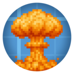

# Create Nuclear Shell 

## About
Create: Nuclear Shell is an addon for Create: Big Cannons that adds a powerful nuclear shell capable of massive destruction and radiation effects. Ideal for chaotic battles or high-tech modpacks.

## Dependencies
- Create: Big Cannons
- Alex's Caves (provides the nuclear bomb item used in crafting)

## Features
- Devastating nuclear explosion
- Radioactive fallout over a wide area

## Translations
Want to help translate the mod?
You can contribute by adding your own language file and submitting a Pull Request.

Here's a simple example of a en_us.json localization file:

```json
{
  "block.canonnukes.nuke_shell": "Nuclear Shell",
  "block.createnukecannon.nuke_shell.tooltip.behaviour2": "Unleashes a powerful nuclear blast, devastating the immediate area in an inferno and irradiating the surrounding environment.",
  "block.createnukecannon.nuke_shell.tooltip.condition2": "On Detonation",
  "block.createnukecannon.nuke_shell.tooltip.behaviour1": "§cA §cfuse §cis §c§l_required_ §cfor §cdetonation - §cit will §c§l_NOT_ §cexplode §con §cits §cown.",
  "block.createnukecannon.nuke_shell.tooltip.condition1": "§cImportant",
  "block.createnukecannon.nuke_shell.tooltip.summary": "\"Now, I am become _Death_, the destroyer of worlds.\"",
  "entity.canonnukes.nuke_shell": "Nuclear Shell"
}
```
Just replace the strings on the right side with translations into your language, and name the file using the proper locale format (e.g. fr_fr.json, uk_ua.json, etc.).
