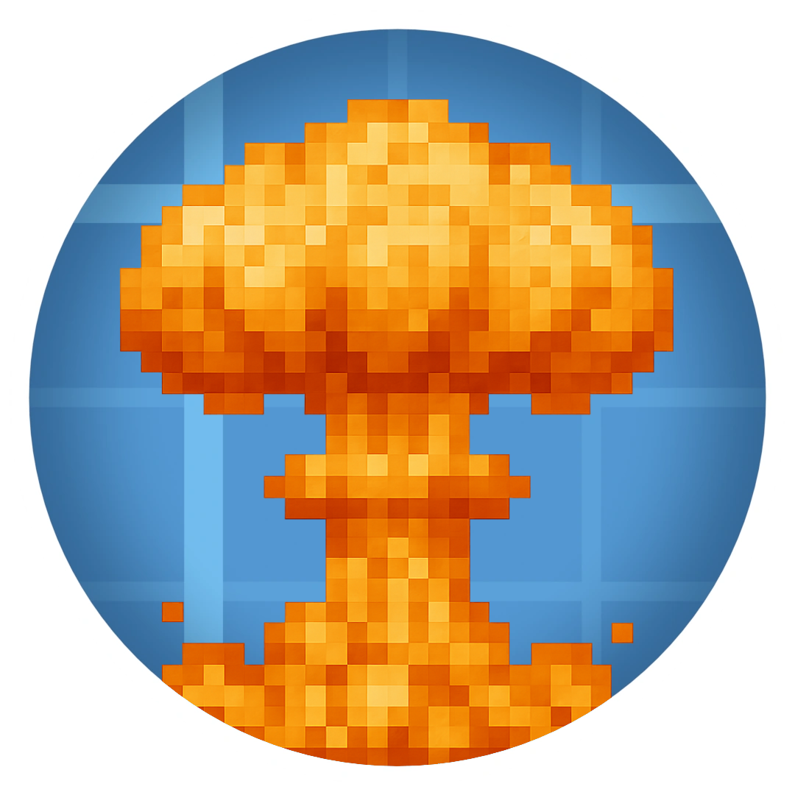
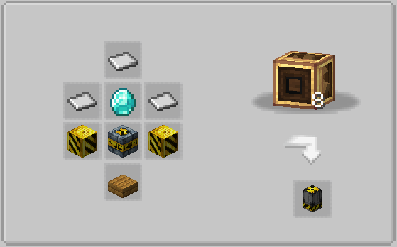

# ☢️ Create: Nuclear Shell



> *"Now I am become Death, the destroyer of worlds."*  
> ― J. Robert Oppenheimer

---

## 🔍 About

**Create: Nuclear Shell** is a high-impact expansion for **Create: Big Cannons** that introduces nuclear artillery capable of catastrophic destruction and lingering radiation effects. Perfect for end-game content or apocalyptic modpacks.

---

## ⚙️ Technical Details

| Category         | Details                           |
|------------------|-----------------------------------|
| **MC Version**   | 1.20.1                            |
| **Dependencies** | Create: Big Cannons, Alex's Caves |
| **License**      | *MIT*                             |

---

## 💥 Features

### ✅ Current Features

- 💣 Nuclear artillery shell with massive explosion radius
- ☢️ Radiation zones that persist after detonation
- 🌋 Secondary firestorms and environmental damage

### 🛠️ Planned Features

| Status | Feature                | Description                          |
|--------|------------------------|--------------------------------------|
| ❌     | Multiple Warhead Types | Tactical nukes, dirty bombs, etc.    |
| ❌     | Configurable Yield     | Adjust explosion power via config    |
| ❌     | New Crafting Chains    | Uranium processing, bomb assembly    |
| ❌     | Independence           | Complete rejection of Alex's Caves      |

---

## 🌍 Translations

We welcome community translations! Here's how to contribute:

1. Copy this template and replace with your translations:
    ```json
    {
      "block.canonnukes.nuke_shell": "Nuclear Shell",
      "block.createnukecannon.nuke_shell.tooltip.behaviour2": "Unleashes a powerful nuclear blast, devastating the immediate area in an inferno and irradiating the surrounding environment.",
      "block.createnukecannon.nuke_shell.tooltip.condition2": "On Detonation",
      "block.createnukecannon.nuke_shell.tooltip.behaviour1": "§cA §cfuse §cis §c§l_required_ §cfor §cdetonation - §cit will §c§l_NOT_ §cexplode §con §cits §cown.",
      "block.createnukecannon.nuke_shell.tooltip.condition1": "§cImportant",
      "block.createnukecannon.nuke_shell.tooltip.summary": "\"Now, I am become _Death_, the destroyer of worlds.\"",
      "entity.canonnukes.nuke_shell": "Nuclear Shell"
    }
    ```

2. Name the file using locale codes (e.g., `fr_fr.json`, `uk_ua.json`)

3. Submit a Pull Request

### ✅ Supported Languages

- ✅ English
- ✅ Russian
- ✅ Ukrainian
- ✅ Chinese
- 🚧 Other

---

## 📜 Changelog

### v3.0.0 *(Current)*

- Initial release
- Basic nuclear shell functionality

---

## ❓ FAQ

**Q:** *When will the developer add answers here??*  
**A:** I don't know when I want to.

**Q:** *How to craft a bomb in the third version of the mod?*  
**A:** It's simple 



---

## 📦 Download

## v3.0.0 (only nuclear shell)
[](https://modrinth.com/mod/create-nuclear-shell/version/3.0.0)  
[](https://www.curseforge.com/minecraft/mc-mods/create-nuclear-shell/files/6660771)


---

> *"We knew the world would not be the same."*
